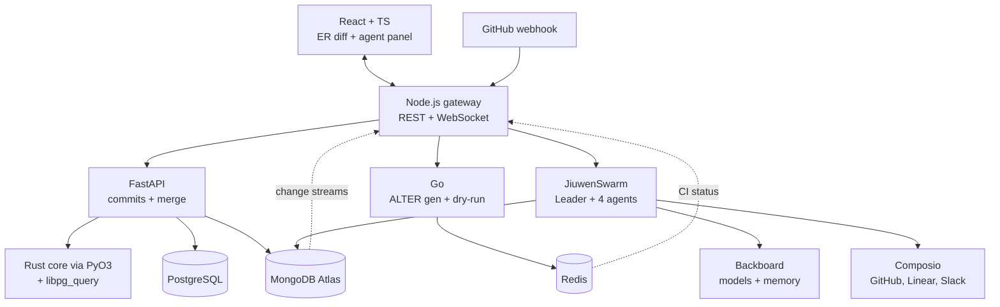

# SchemaSync

**GitHub for your database.** Every schema change is a commit, the diff is a live ER diagram, and before anything merges, a team of AI agents reviews the migration against your real codebase.

Built in 36 hours at Hack the North 2026.

## How it works

Submit the *full desired schema* as DDL — like Prisma or Atlas CLI, commits are declarative. A Rust core built on `libpg_query` (Postgres's own parser) parses both snapshots and computes a deterministic semantic diff. The diff renders as a live ER diagram: green for added, red for dropped, yellow for modified.

Open a merge request and a five-agent review board takes over. Agents never call each other — every message lands on a MongoDB Atlas collection (the *agent board*), and Atlas change streams push the whole conversation to the browser live. Every migration is dry-run against a real Postgres with seeded data before a human clicks Approve.



### The agents

| Agent | Tools | Output |
|---|---|---|
| Leader | Swarmflow, Backboard memory | Task plan, final verdict |
| Schema Analyst | Rust diff, rename detector | Structured change list |
| Impact Scout | Composio GitHub code search | Files touching changed columns |
| Migration Engineer | Go dry-run, Atlas Vector Search | Validated migration, revised if needed |
| Release Agent | Composio PR, Linear, Slack | External actions, gated behind human approval |

The collaboration moment: the Impact Scout finds a dropped column referenced in 4 files, and the Migration Engineer rewrites its plain `DROP` into an expand/contract migration — the column survives this deploy and is dropped only after the referencing code ships.

**Atlas holds facts** (what the schema was, what changed). **Backboard holds lessons** (what the team learned from it).

## Repo layout

```
core/       Rust: pg_query parse, normalize, diff; PyO3 bindings
vcs/        Python/FastAPI: commits, branches, merge requests, rename detector
migrator/   Go: SQL generation + dry-run runner
agents/     Python: review board, agent board, scripted fallback
gateway/    Node/TS: proxy, WebSocket, change-stream + CI relay
web/        React/TS: react-flow ER diff, review panel
infra/      docker-compose, init.sql, reset script
```

## Quickstart

Prereqs: Rust (MSVC + LLVM/libclang on Windows), Python 3.13 + [uv](https://docs.astral.sh/uv/), Go 1.26+, Node 22+, Docker.

```bash
# data stores (meta-db on host port 5434, dryrun-db on 5433, redis, mongo)
cd infra && docker compose up -d && cd ..

# python env + rust extension
uv venv && uv pip install -r requirements.txt
uv pip install torch --index-url https://download.pytorch.org/whl/cpu
maturin develop -m core/Cargo.toml

# services (each in its own terminal)
python -m uvicorn vcs.main:app --port 8000
python -m uvicorn agents.main:app --port 8090
cd migrator && go run .
cd gateway && npm i && npm run dev
cd web && npm i && npm run dev        # open http://localhost:5173

# seed the demo repo (main + feature/add-payments)
python -m vcs.seed --full
```

Reset everything to a cold demo state at any time:

```bash
python -m infra.reset
```

Set `ATLAS_URI` in `.env` (see `.env.example`) to use a real MongoDB Atlas cluster; without it, a local single-node replica set container stands in — change streams work either way.

## Tests

```bash
cargo test --manifest-path core/Cargo.toml   # parser + diff golden fixtures
cd migrator && go test ./...                  # generator + round-trip proof
```

The round-trip test is the single proof the pipeline is correct: for schemas A and B, it applies `generate(diff(A, B))` to a real database seeded from A, introspects the result from `pg_catalog`, and asserts it equals B — on every fixture.

## Decision log

| Decision | Why |
|---|---|
| `libpg_query`, not a hand-written parser | It is Postgres's actual parser; the grammar is never the bug |
| Declarative commits | The diff engine only compares whole schemas; there is no ALTER interpretation to build |
| Fresh *database* per dry-run, not a fresh container | No Docker-in-Docker; dry-runs take milliseconds on one warm container |
| Dry-runs seed 3 typed rows per table | An empty table lets `ADD COLUMN ... NOT NULL` pass; catching that is the point |
| Agents talk only through the Atlas board | Auditable, replayable, and it powers the live UI through change streams |
| The Engineer's revision is an explicit stage | The negotiation happens every run; only its content is generated live |
| One embedding model (MiniLM, 384-dim, CPU) | Powers both rename detection and Atlas Vector Search; no paid embedding API |
| Sponsor SDKs behind thin adapters | An API surprise costs one file, not the flow |
| Round-trip via `pg_catalog` introspection | Same proof as parsing `pg_dump` output, with no text-format dependency |

## Demo floors

Two demo floors protect the pitch: `floor-1` (version control + visual ER diff) and `floor-2` (full review flow with scripted agents on real data — real diff, real generated SQL, real dry-run). Live agents replace the script one at a time without changing a single message shape, so the UI never knows the difference.
